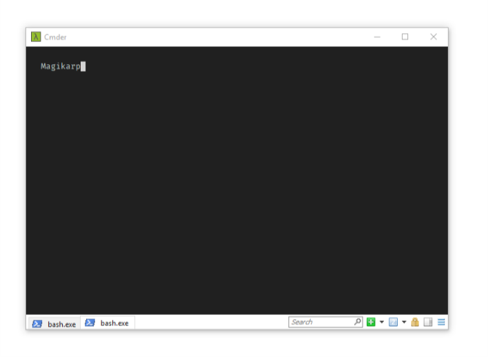
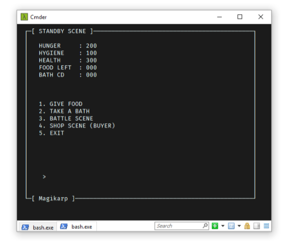
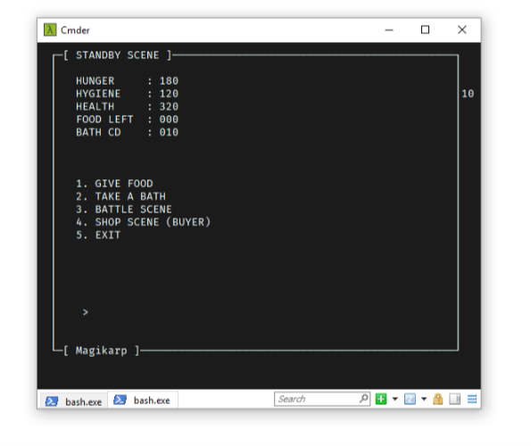
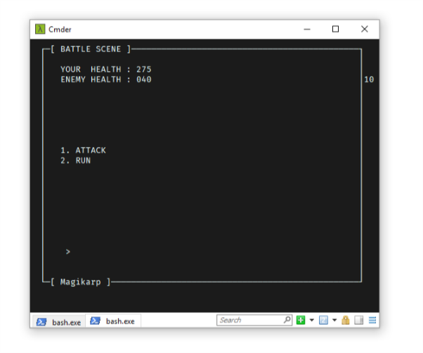
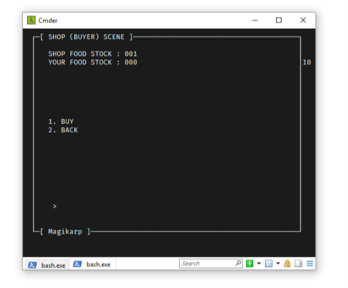
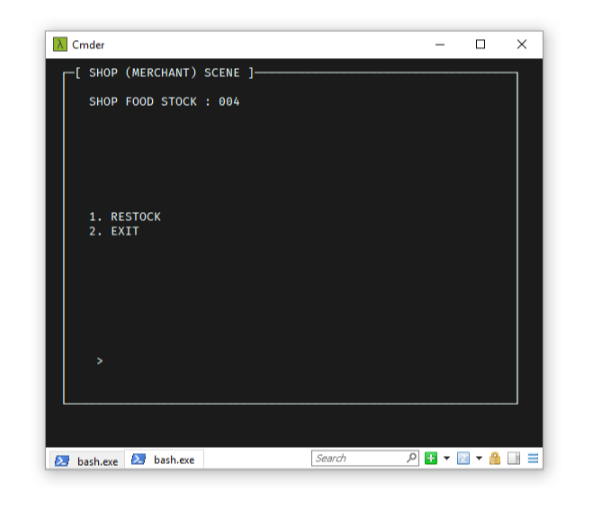

# SoalShift_modul3_E05

> 05111740000052 Anggar Wahyu Nur Wibowo

>  05111740000099 Bobbi Aditya


## Nomor 1

Pada soal nomor 1 kita diminta untuk melakukan perhitungan fibonacci dari inputan bilangan-bilangan yang ditentukan, lalu menampilkan hasil perhitungannya secara berurutan

### Hitung Faktorial
```c
int fakto(int n)
{
	int hasil=1;
	int i;

	if(n==0) return 0;
	for(int i=1;i<=n;i++)
	{
		hasil=hasil*i;
	}

	return hasil;
}
```
Kodingan di atas akan mereturn nilai hasil dari proses perhitungan fibonaci

### Proses Sorting
```c
void swap(int *xp, int *yp) 
{ 
    int temp = *xp; 
    *xp = *yp; 
    *yp = temp; 
} 

void bubbleSort(int arr[], int n) 
{ 
   int i, j; 
   for (i = 0; i < n; i++)       
  
       // Last i elements are already in place    
       for (j = 0; j < n-i-1; j++)  
           if (arr[j] > arr[j+1]) 
              swap(&arr[j], &arr[j+1]); 
}
```
Kodingan di atas berguna untuk melakukan sorting. Algoritma sorting yang kami gunakan adalah bubble sort. Sorting ini kemudian akan digunakan untuk sorting hasil dari proses perhitungan fibonacci tiap-tiap angka

### Thread
```c
void *jalanin(void *arg)
{
    pthread_t id=pthread_self();
	FOR(i,jumlah)
	{
	    if(pthread_equal(id, tid[i])) 
	    {
	    	hasil[i]=fakto(temp[i]);
	    }
	}
}
.
.
.
   FOR(i, jumlah)
    {
		pthread_join(tid[i],NULL);
    }
```
Untuk setiap input angka akan membuat sebuah thread baru. Masing-masing thread akan menjalankan fungsi perhitungan faktorial dan menyimpannya ke array hasil. Selain itu juga saya melakukan join thread untuk semua thread yang telah dibuat agar thread bisa jalan bersama


### Scan angka
```c
int main(int argc, char *argv[])
{
	int i=0;
	int err;
	jumlah=argc;
	for(i=0;i<jumlah;i++)
	{
		temp[i]=atoi(argv[i]);
		//printf("%d\t",temp[i]);
	}
.
.
.
```
Pada kodingan di atas saya mengubah input angka yang awalnya saya simpan dalam bentuk char menjadi int dengan menggunakan fungsi `atoi()`

### Print Hasil
```c
for(int i=1;i<jumlah;i++)
{
    printf("%d!=%d\n",temp[i],hasil[i]);
}
```

setelah melakukan perhitungan faktorial dan proses sorting, maka hasil akan diprint

### Hasil


## Nomor 2
Pada soal ini, kami diminta untuk membuat sebuah client-server program untuk pembeli dan penjual. Pembeli dan penjual akan bisa mengakses variabel yang sama. Untuk itu, kami menggunakan shared memory.

Ada beberapa permintaan soal, seperti berikut:
- Terdapat 2 server: server penjual dan server pembeli
- 1 server hanya bisa terkoneksi dengan 1 client
- Server penjual dan server pembeli memiliki stok barang yang selalu sama
- Client yang terkoneksi ke server penjual hanya bisa menambah stok
- Client yang terkoneksi ke server pembeli hanya bisa mengurangi stok
- Server pembeli akan mengirimkan info ke client yang terhubung dengannya
apakah transaksi berhasil atau tidak berdasarkan ketersediaan stok
- Server penjual akan mencetak stok saat ini setiap 5 detik sekali
-  Menggunakan thread, socket, shared memory
  
### Server-penjual

####  Shared Memory
```c
void connect_sm(){
    key_t key = 1242;

    shmid = shmget(key, sizeof(int), IPC_CREAT | 0666);
    value = shmat(shmid, NULL, 0);

    return;
}
```

Kodingan di atas berguna untuk membuat variable value supaya nanti bisa digunakan oleh semua program dengan key `1242`

#### Menerima pesan dari client penjual
```c
    while(1){
        valread = read(new_socket, buffer, 1024);

        char *status[2] = {"transaksi berhasil", "transaksi gagal"};
        // printf("[B] : %s, %d\n", buffer, valread);
        // to detect if socket had been closed
        if((strcmp(buffer, "tambah") == 0) && (valread != 0)){
            *value += 1;
            send(new_socket, status[0], strlen(status[0]), 0);
        } else {
            send(new_socket, status[1], strlen(status[0]), 0);
        }
    }
}
```
Dalam kodingan di atas, server akan menerima pesan yang dikirimkan oleh client. Jika pesan tersebut adalah string `tambah` maka, nilai value akan di tambah. Kemudian server akan mengirimkan pesan `transaksi berhasil`.

#### Thread
```c
void* multr(void *arg){
    pthread_t id = pthread_self();

    if(pthread_equal(id, tid[0])){
        time_t rawtime;
        struct tm * timeinfo;
        while(1){
            time(&rawtime);
            timeinfo = localtime(&rawtime);

            printf("%d : %s", *value, asctime(timeinfo));
            sleep(5);
        }
    } 
}
```
Thread ini berguna untuk menampilkan jumlah value saat ini beserta waktu saat ini.

### Server-Pembeli
####  Shared Memory
```c
void connect_sm(){
    key_t key = 1242;

    shmid = shmget(key, sizeof(int), IPC_CREAT | 0666);
    value = shmat(shmid, NULL, 0);

    return;
}
```

Kodingan di atas berguna untuk membuat variable value supaya nanti bisa digunakan oleh semua program dengan key `1242`
#### Menerima pesan dari pembeli
```c
while(1){
    valread = read(new_socket, buffer, 1024);
    if((strcmp(buffer, "beli") == 0) && (valread != 0)){
        if(--new_value >= 0){
            *value = new_value;
            send(new_socket, status[0], strlen(status[0]), 0);
        } else {
            send(new_socket, status[1], strlen(status[0]), 0);
        }
        printf("%d\n", *value);
    } else {
        send(new_socket, status[1], strlen(status[0]), 0);
    }
}
```
Dalam kodingan di atas, server akan menerima pesan dari client pembeli. Jika pesan yang diterima adalah string `beli` maka value akan dikurangin 1, dan server akan mengirimkan pesan `transaksi berhasil`.


### Client
Client pembeli dan penjual memiliki code yang sama karena melakukan perintah-perintah yang sama.

#### Mengirimkan pesan
```c
while(1){
    strcpy(cmd, "");
    scanf("%s", cmd);
    send(sock, cmd, 10 , 0 );
    valread = read(sock, buffer, 1024);
    printf("%s\n", buffer);
}
```
Kodingan di atas berguna untuk mengirimkan pesan string kepada server.Kemudian menerima pesan dari server dalam bentuk string dan mencetaknya ke user.

### Hasil

Di bawah ini adalah hasil dari program server-penjual(kiri) dan client-penjual(kanan)


Di bawah ini adalah hasil dari program server-pembeli(kiri) dan client-pembeli(kanan)

## Nomor 3
Pada soal nomor 3 kita diberikan sebuah permasalahan tentang Agmal dan Iraj. Agmal memiliki `WakeUp_Status`yang awalnya 0 dan Iraj memiliki `Spirit_Status` yang awalnya 100. Agmal bisa menambah `WakeUp_Status` nya , Iraj bisa mengurangi `Spirit_Status` nya.

Fitur:
- All Status, yaitu menampilkan status kedua sahabat
Ex: Agmal WakeUp_Status = 75
Iraj Spirit_Status = 30
- “Agmal Ayo Bangun” menambah WakeUp_Status Agmal sebesar
15 point
- “Iraj Ayo Tidur” mengurangi Spirit_Status Iraj sebanyak 20 point

Kondisi:
- Jika Fitur “Agmal Ayo Bangun” dijalankan sebanyak 3 kali, maka
Fitur “Iraj Ayo Tidur” Tidak bisa dijalankan selama 10 detik
(Dengan mengirim pesan ke sistem “Fitur Iraj Ayo Tidur disabled
10 s”)
- Jika Fitur “Iraj Ayo Tidur” dijalankan sebanyak 3 kali, maka Fitur
“Agmal Ayo Bangun” Tidak bisa dijalankan selama 10 detik
(Dengan mengirim pesan ke sistem “Agmal Ayo Bangun disabled
10 s”)

Program akan berhenti jika Salah Satu :
- WakeUp_Status Agmal >= 100 (Tampilkan Pesan “Agmal
Terbangun,mereka bangun pagi dan berolahraga”)
- Spirit_Status Iraj <= 0 (Tampilkan Pesan “Iraj ikut tidur, dan
bangun kesiangan bersama Agmal”)

### Update WakeUp_Status Agmal
```c
void menu1()
{
	WU_stats=WU_stats+15;
	flag1++;
}
void *jalanmenu1(void *arg)
{
	while(1)
	{
		while(!statusagmal)
		{
			if(flag2==3)
			{
				printf("Agmal Ayo Bangun disabled 10 s\n");				
				flag2=0;
				status=0;
				statusagmal=1;
				sleep(10);
				statusagmal=0;
			}
			else if(inp==1)
			{
					//printf("masuk menu 1 dong\n");
					menu1();
					inp=99;
					status=0;
			}
		}
	}
}
```
Potongan Code diatas berguna untuk menambah wakeup status agmal dan mendisable(`sleep(10)`) thread ini apabila fitur iraj dijalankan 3 kali.


### Update SpiritStatus Iraj
```c
void menu2()
{
	S_stats=S_stats-10;
	flag2++;
}

void *jalanmenu2(void *arg)
{
	while(1)
	{
		while(!statusiraj)
		{
			if(flag1==3)
			{
					printf("Fitur Iraj Ayo Tidur disabled 10 s\n");
					flag1=0;
					status=0;
					statusiraj=1;
					sleep(10);
					statusiraj=0;
			}
			else if(inp==2)
			{

					//printf("masuk menu 2 dong\n");
					menu2();
					inp=99;
					status=0;
				
			}
		}
		
	}
}
```
Potongan Code diatas berguna untuk mengurangi spirit status iraj dan mendisable(`sleep(10)`) thread ini apabila fitur agmal dijalankan 3 kali.

### Input
```c
void input()
{
		if(WU_stats>=100)
			{
				printf("Agmal Terbangun,mereka bangun pagi dan berolahraga\n");
				kill(0,SIGKILL);
							
			}
		else if (S_stats <=0)
			{
				printf("Iraj ikut tidur, dan bangun kesiangan bersama Agmal\n");
				kill(0,SIGKILL);
			
			}
		else
			{
				printf("Masukkan input\n0=All Status\n1=Agmal Ayo Bangun\n2=Iraj Ayo Tidur\n");
				scanf("%d",&inp);
				if(inp==0)
				{
					menu0();
					inp=99;
					status=0;
				}
			}
}

void *jalaninput(void *arg)
{
	while(1)
	{
		if(!status || statusagmal || statusiraj)
		{
			sleep(1);
			//printf("%d-%d-%d\n",status,statusagmal,statusiraj);
			status=1;
			input();

		}

	}
	
}
```
Code diatas digunakan untuk menerima input user. Pilihan untuk menjalankan fitur all status juga ada pada potongan code di atas.

User akan tetap terus bisa melakukan input walaupun ada salah satu fitur yang di disable.

Pada saat ada kondisi terminasi yang terpenuhi, maka program otomatis akan berhenti. Untuk menghentikan program kami menggunakan `kill(0,SIGKILL);`

### Fungsi All Status
```c
void menu0()
{
	printf("Agmal WakeUp_Status = %d\nIraj Spirit_Status = %d\n",WU_stats,S_stats);
}
```
Potongan code diatas untuk memampilkan jumlah spirit_status dan wake_up status saat ini.

### Main Program
```c
int main(void)
{
	pthread_create(&(tid[1]), NULL,&jalanmenu1, NULL);
	pthread_create(&(tid[2]), NULL,&jalanmenu2, NULL);
	pthread_create(&(tid[0]), NULL,&jalaninput, NULL);
	pthread_join(tid[1],NULL);
	pthread_join(tid[2],NULL);
	pthread_join(tid[0],NULL);
		  
}
```
Potongan Code diatas adalah main program kami. Pada main program, kami membuat 3 buah thread dan menjoinkan semua thread agar thread-thread yang ada berjalan bersamaan.
## Nomor 4

Pada soal nomor 4 kita diminta untuk:
- menyimpan 10 list proses ke dalam 2 file
- mengompres 2 file tersebut
- mengunzip 2 file tersebut

Dengan syarat pada saat menyimpan, kedua file disimpan secara bersamaan. Pada saat mengompres, kedua file dikompres secara bersamaan. Pada saat unzip, kedua file diunzip secara bersamaan

### Menyimpan list proses
```c
//fungsi membuat file
void bikin1()
{
	system("ps -aux|head -11 | tail -10 > $HOME/Documents/FolderProses1/SimpanProses1.txt");
}

void bikin2()
{
	system("ps -aux|head -11 | tail -10 > $HOME/Documents/
    FolderProses2/SimpanProses2.txt");	
}
//thread
void *lsproses(void *argv)
{
	pthread_t id=pthread_self();
        if(pthread_equal(id,tid[0]))
        {
                bikin1();
        }
        else if(pthread_equal(id,tid[1]))
        {
                bikin2();
        }
}
.
.
.
//pada main
//lsproses
while(i<2)
{
    err=pthread_create(&(tid[i]),NULL,&lsproses,NULL); //membuat thread
    if(err!=0) //cek error
    {
        //printf("\n can't create thread : [%s]",strerror(err));
    }
    else
    {
        //printf("\n create thread success\n");
    }
    i++;
}
pthread_join(tid[0],NULL);
pthread_join(tid[1],NULL);
```
Untuk menyimpan hasil ps -aux, kami menggunakan `system` dan kemudian menyimpan hasill ps- aux ke dalam folder yang ditentukan.

Agar kedua proses ps -aux bisa berjalan bersamaan, kami juga menggunakan join thread

### Zip File
```c
//fungsi zip file
void zip1()
{

	system("zip -rmj $HOME/Documents/FolderProses1/KompresProses1.zip $HOME/Documents/FolderProses1/SimpanProses1.txt");
	//printf("Menunggu 15 detik untuk mengekstrak kembali SimpanProses1\n");
}

void zip2()
{
	system("zip -rmj $HOME/Documents/FolderProses2/KompresProses2.zip $HOME/Documents/FolderProses2/SimpanProses2.txt");
	//printf("Menunggu 15 detik untuk mengekstrak kembali SimpanProses2\n");
}
//thread
void *zipfile(void *argv)
{
	pthread_t id=pthread_self();
        if(pthread_equal(id,tid[0]))
        {
                zip1();
        }
        else if(pthread_equal(id,tid[1])) // thread menampilkan gambar
        {
                zip2();
        }
}
.
.
//Pada main
while(i<2)
{
    err=pthread_create(&(tid[i]),NULL,&zipfile,NULL); //membuat thread
    if(err!=0) //cek error
    {
        //printf("\n can't create thread : [%s]",strerror(err));
    }
    else
    {
        //printf("\n create thread success\n");
    }
    i++;
}	
pthread_join(tid[0],NULL);
pthread_join(tid[1],NULL);
```
Untuk melakukan zip file kami menggunakan `system` dan menggunakan fungsi `zip` dengan option `-rmj`. Option tersebut berguna agar pada saat melakukan zipping, file yang akan dizip akan langsung terhapus setelah proses zipping selesai. Selain itu juga berguna agar membuat hasil zip didalamnya terdiri dari 1 file `SimpanProses*` saja, tanpa ada direktori-direktori lainnya.

Agar kedua proses zip bisa berjalan bersamaan, kami juga menggunakan join thread.

### Unzip File
```c
///fungsi unzip
void unzip1()
{
	system("unzip $HOME/Documents/FolderProses1/KompresProses1.zip -d $HOME/Documents/FolderProses1/");
}

void unzip2()
{
	system("unzip $HOME/Documents/FolderProses2/KompresProses2.zip -d $HOME/Documents/FolderProses2/");
}

//Thread
void *unzipfile(void *argv)
{
	pthread_t id=pthread_self();
        if(pthread_equal(id,tid[0]))
        {
                unzip1();
        }
        else if(pthread_equal(id,tid[1])) // thread menampilkan gambar
        {
                unzip2();
        }
}
.
.
.
//pada main
while(i<2)
{
    err=pthread_create(&(tid[i]),NULL,&unzipfile,NULL); //membuat thread
    if(err!=0) //cek error
    {
        //printf("\n can't create thread : [%s]",strerror(err));
    }
    else
    {
        //printf("\n create thread success\n");
    }
    i++;
}	
pthread_join(tid[0],NULL);
pthread_join(tid[1],NULL);
```
Untuk melakukan unzip kami menggunakan `system` dan fungsi `unzip` dengan option `-d`. Option tersebut digunakan agar hasil kompres bisa diarahkan ke folder yang diinginkan.

Agar kedua proses unzip bisa berjalan bersamaan, kami juga menggunakan join thread.


### Hasil


## Soal 5

Pada soal ini, kami menggunakan multithread dan shared memory. Selain itu, kami menggunakan *library* `ncurses.h` untuk tampilannya.

Secara umum, kita akan membagi beberapa program untuk melakukan input, menampilkan status, menampilkan menu, dan juga memperbarui variabelnya.

### Struktur Data

Data monster disimpan dalam struct yang memiliki spesifikasi.

```c
struct monster {
    char name[50];
    int status[3], status_flag[3];

    int foodstock;
};
```

Variabel `name` merupakan nama monster, `status` berupa nilai status dari masing-masing elemen yaitu secara terurut hunger, hygiene, dan health. `status_flag` digunakan untuk menentukan apakah status akan melakukan regenerasi setiap waktu. `foodstock` merupakan stok dari makanan yang kita miliki.

Struct monster digunakan untuk monster pemain dan NPC.

### Thread

Pada dasarnya kita akan memakai enam thread, yaitu ...

```c
pthread_create(&(tid[0]), NULL, &maintain_interface, NULL);
pthread_create(&(tid[1]), NULL, &maintain_hunger, NULL);
pthread_create(&(tid[2]), NULL, &maintain_hygiene, NULL);
pthread_create(&(tid[3]), NULL, &maintain_health, NULL);
pthread_create(&(tid[4]), NULL, &maintain_bath, NULL);
pthread_create(&(tid[5]), NULL, &maintain_life, NULL);
```

Jadi nantinya setiap thread akan dibind di fungsi masing-masing untuk memaintain sesuatu. Seperti contohnya, `maintain_interface` digunakan untuk maintain tampilan antarmuka, `maintain_health` untuk maintain darah dari monster.

### Interface

Tampilan antarmuka ditangani oleh thread `maintain_interface`. Tampilan secara umum, akan dibuatkan dalam sebuah window, yang akan menampilkan judul, status, dan menu.

Secara umum tampilan nantinya akan terbagi menjadi beberapa scene. Scene tersebut antara lain:
1. Scene Standby
2. Scene Battle
3. Scene Shop (Buyer)

Selain itu, ada scene lain yaitu Scene Shop (Merchant) yang dipisah di program lain.

Dari masing-masing scene, nantinya akan dibagi lagi menjadi `(scene)-status` untuk menampilkan status dari masing-masing scene, dan `(scene)-menu` untuk menampilkan pilihan menu yang ada dan metode inputnya.

#### Tampilan Antarmuka 

Untuk tampilan antarmuka sendiri kami membuat *helper function* untuk memudahkan pembuatan tampilan di masing-masing scene.

```c
void scene_init(char * title){
    werase(win);

    box(win, 0, 0);
    mvwprintw(win,  0, 2, "[ %s SCENE ]", title);
    mvwprintw(win, 23, 2, "[ %s ]", mpp.name);
}
````

#### Menampilkan Status

Untuk menampilkan status, kita mencetak nilai dari masing-masing status.

```c
int scene_idle_status(){
    switch_status_flag(1);

    clear_status();

    mvwprintw(win, 2, 4, "HUNGER     : %03d", mpp.status[0]);
    mvwprintw(win, 3, 4, "HYGIENE    : %03d", mpp.status[1]);
    mvwprintw(win, 4, 4, "HEALTH     : %03d", mpp.status[2]);
    mvwprintw(win, 5, 4, "FOOD LEFT  : %03d", mpp.foodstock);
    mvwprintw(win, 6, 4, "BATH CD    : %03d", bath_c[1]);

    wrefresh(win);
}
```

Modularisasi fungsi dari status idle ditujukan agar nantinya ketika setiap thread yang melakukan perubahan di variabel status, tinggal memanggil fungsi status untuk memperbarui data status di tampilan, tanpa perlu memanggil fungsi scene.

Untuk dapat memanggil masing-masing fungsi untuk refresh kita menyimpan fungsi status sekarang ke variabel `scene_current_status`, sehinga nantinya kita hanya perlu memanggil `scene_current_status()`.

#### Tampilan Menu

Untuk tampilan menu, selain menampilkan menu, kita juga menunggu *input* dari pemain. Untuk memudahkan membuat menu dari masing-masing scene, kami menggunakan *helper function* `menu()`.

```c
void menu(char ** choices, int (**routes) (), int (**statuses) (), int ch_c){
    int base = 10;

    FOR(i, ch_c){
        mvwprintw(win, base+i, 4, "%s", choices[i]);
    }

    mvwprintw(win, 20, 4, " > ");    

    wrefresh(win);

    // Input
    char c;
    while((c = getch())){
        if(c >= '1' && c <= ch_c+'1') break;
    }

    // Route handling
    FOR(i, ch_c){
        if(i == (int)c - (int)('1')){
            clear_status();
            pthread_mutex_lock(&mutex_sc);
            scene_current_status = statuses[i];
            pthread_mutex_unlock(&mutex_sc);
            ((routes[i])) ();
        }
    }
}
```

Dari kode di atas, kita memerlukan parameter `choices`, `routes`, `status`, dan `ch_c`. Choices adalah deskripsi dari masing-masing menu. Routes adalah fungsi yang akan dipanggil dari masing-masing menu. Status menyimpan fungsi status dari masing-masing choices yang nantinya digunakan untuk memperbarui `scene_current_status`.

#### Standby Scene

Pada scene kali ini, kita harus melakukan fungsi regenerasi untuk variabel hunger, hygiene, dan health. Regenerasi dilakukan di masing-masing thread `maintain_(var)`.

```c
void *maintain_hygiene(void *arg){
    while(1){
        sleep(30);

        if(mpp.status_flag[1] != 0){
            mpp.status[1] -= 10;
            scene_current_status ();
        }
    }
}
```
Dalam contoh fungsi untuk maintain hygiene di atas, pertama kita sleep sesuai waktu yang ditentukan, kemudian kita mengubah nilai dari status hygiene yang berada pada `mpp.status[1]`. Fungsi untuk maintain hunger dan health sendiri cukup mirip dengan fungsi `maintain_hygiene` di atas.

Selain memaintain status dari monster sendiri, kita juga perlu memaintain status dari cooldown mandi. 

```c
int scene_idle_menu(){
    char *menus[] = {"1. GIVE FOOD",
                     "2. TAKE A BATH",
                     "3. BATTLE SCENE", 
                     "4. SHOP SCENE (BUYER)", 
                     "5. EXIT"};

    int (*routes[5]) () = {eat, bath, 
                           scene_battle, scene_shop_buyer, 
                           route_exit};

    int (*statuses[5]) () = {scene_idle_status, scene_idle_status,
                             scene_battle_status, scene_shop_buyer_status, 
                             scene_idle_status};

    menu(menus, routes, statuses, 5);
}
```

Untuk pilihan menu di scene sendiri ada beberapa pilihan, dengan pilihan masing-masing akan dipetakan ke suatu fungsi di `routes`.

Untuk fungsi `eat()` dan `bath()` sendiri nantinya ketika fungsi telah selesai dieksekusi akan kembali ke `scene_idle` lagi.

```c
int eat(){
    if(mpp.foodstock != 0){
        pthread_mutex_lock(&mutex);
        mpp.status[0] += 15;
        mpp.status[0] = (mpp.status[0] > 200) ? 200 : mpp.status[0];
        pthread_mutex_unlock(&mutex);
        mpp.foodstock--;
    }

    scene_idle();
}

int bath(){
    pthread_mutex_lock(&mutex_b);
    if(bath_c[0] != 0){ // Bisa dipakai
        mpp.status[1] += 30;
        bath_c[0] = 0;
        bath_c[1] = 20;
    }

    pthread_mutex_unlock(&mutex_b);

    scene_idle();
}
```
#### Battle Scene

Secara umum, kode untuk scene battle sendiri seperti scene sebelumnya, hanya saja pilihan yang disediakan hanya dua yaitu **Attack** atau **Run**. Pilihan Run akan mengakibatkan pemain kembali ke menu standby. Sedangkan untuk pilihan Attack, nantinya akan menjalankan fungsi di bawah, yang kemudian akan kembali lagi ke Battle Scene.

```c
int battle_attack(){
    mpp.status[2] -= 20;
    npc.status[2] -= 20;

    if(mpp.status[2] <= 0 || npc.status[2] <= 0){
        scene_idle();
    }

    scene_current_status();
    scene_battle_menu();

    getch();
}
```

#### Shop (Buyer) Scene

Kode secara garis besar, seperti kode Battle Scene sebelumnya, hanya saja ada dua kemungkinan **Buy** atau **Back**. Pilihan Back akan mengembalikan kita ke standby scene. Sedangkan untuk pilihan Buy, akan melakukan kode di bawah.

```c
int shop_buy(){
    if(*shop_foodstock != 0){
        pthread_mutex_lock(&mutex_fsf);
        *shop_foodstock -= 1;
        pthread_mutex_unlock(&mutex_fsf);
        mpp.foodstock++;
    }

    scene_shop_buyer();
}
```

Pada kode di atas, kita akan membeli makanan dari toko dengan stok yang sudah ada. Variabel `shop_foodstock` merupakan nilai yang dibagi antara dua proses, berupa game ini dan program merchant. Pembagian dari variabel tersebut menggunakan *shared memory*.

#### Die Scene

Ada kalanya monster yang kita miliki tidak memiliki status yang baik dan mengakibatkan pada kematiannya, oleh karena itu ada Die Scene. Untuk scene ini akan dimaintain oleh thread `maintain_life`.

```c
void *maintain_life(void *arg){
    while(1){
        sleep(1);

        FOR(i, 3){
            if(mpp.status[i] <= 0){
                pthread_mutex_lock(&mutex_sc);  
                scene_current_status = scene_die_status;
                pthread_mutex_unlock(&mutex_sc);

                scene_die();
            }
        }
    }
}
```

Pada potongan kode di atas, thread akan secara terus menerus mengecek apakah ada salah satu komponen status yang telah mencapai nol. Jika ditemui ada status yang memiliki nilai nol, maka akan dialihkan ke die scene.

```c
int scene_die_status(){
    clear_status();

    mvwprintw(win, 10, 4, "YOUR MONSTER DIE!");
    mvwprintw(win, 12, 4, "Press x button to exit...");

    wrefresh(win);
}

int scene_die(){
    scene_init("MONSTER DIE");

    scene_die_status();

    while(getch() != 'x');

    endwin();
    curs_set(1);
    exit(0);
}
```
### Merchant Shop Program

Pada program *merchant* ini, kita akan mengubah memanipulasi variabel `shop_foodstock` yang dibagi dengan game.

```c
int *shop_foodstock = 0;
key_t key = 4242;

int shmid = shmget(key, sizeof(int), IPC_CREAT | 0666);
shop_foodstock = shmat(shmid, NULL, 0);
```

Untuk pilihan yang mungkin adalah perintah restock dan keluar. Untuk perintah restock sendiri akan mengeksekusi kode di bawah.

```c
int shop_restock(){
    *shop_foodstock += 1;

    scene_shop_merchant();
}
```

Pada program di atas, hanya melakukan manipulasi shared memory, sedangkan untuk menginisialisasi shared memory sendiri, kami membuat fungsi bantuan lainnya (`soal5i.c`).

### Tampilan Layar







